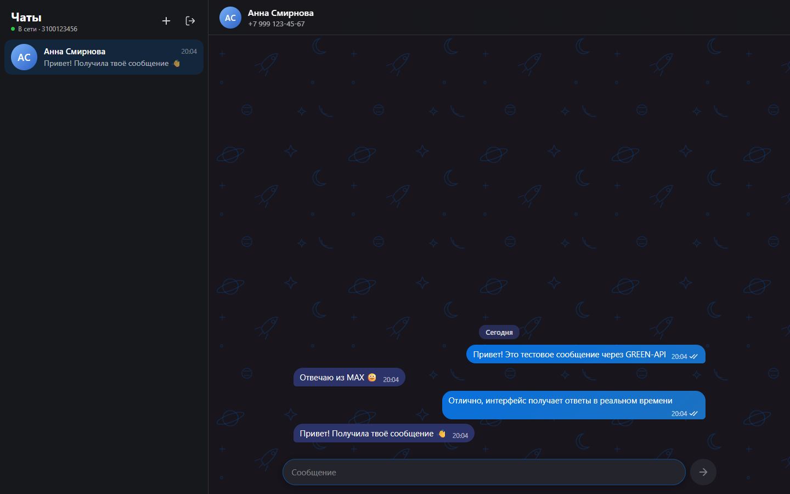
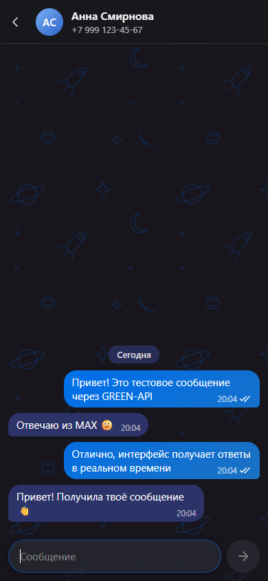

# MAX Chat · GREEN-API

Веб-интерфейс для отправки и получения текстовых сообщений в мессенджере **MAX** через [GREEN-API](https://green-api.com/max). Внешний вид повторяет тёмную тему [web.max.ru](https://web.max.ru/).

Тестовое задание на должность «Фронтенд-разработчик React».

**Демо:** https://seitek2002.github.io/green-api-max-chat/

<p>
  
  
</p>

## Возможности

- Вход по `idInstance` и `apiTokenInstance`: учётные данные проверяются методом `getStateInstance`, при ошибке показывается понятное сообщение.
- Создание чата по номеру телефона: номер нормализуется (`8…` → `7…`) и проверяется методом `CheckAccount`, который возвращает `chatId` пользователя MAX.
- Отправка текстовых сообщений методом [`SendMessage`](https://green-api.com/v3/docs/api/sending/SendMessage/).
- Получение сообщений по технологии [HTTP API](https://green-api.com/v3/docs/api/receiving/technology-http-api/): long polling `ReceiveNotification` → обработка → `DeleteNotification`.
- Статусы исходящих сообщений: отправляется, отправлено, доставлено, прочитано, ошибка (с кнопкой «Повторить»).
- Входящие сообщения от новых собеседников автоматически создают чат, есть счётчик непрочитанных.
- История и учётные данные хранятся в `localStorage` и переживают перезагрузку страницы.
- Адаптивная вёрстка: на мобильных экранах список чатов и окно переписки открываются по очереди.

## Быстрый старт

Требуется Node.js 20+.

```bash
git clone https://github.com/Seitek2002/green-api-max-chat.git
cd green-api-max-chat
npm install
npm run dev
```

Приложение откроется на http://localhost:5173.

### Подготовка инстанса GREEN-API

1. Зарегистрируйтесь в [личном кабинете GREEN-API](https://console.green-api.com) и создайте инстанс MAX.
2. Авторизуйте инстанс: в приложении MAX откройте «Профиль → Устройства → Войти по QR-коду» и отсканируйте QR-код из личного кабинета. Для входа по QR-коду нужно отключить облачный пароль в MAX.
3. В настройках инстанса оставьте **пустым** поле `webhookUrl` и включите получение входящих уведомлений. Если указан webhook, метод `ReceiveNotification` не возвращает уведомления.
4. Скопируйте `idInstance` и `apiTokenInstance` и введите их на странице входа. Хост API (`apiUrl`) определяется автоматически по первым четырём цифрам `idInstance`. При необходимости его можно изменить в блоке «Дополнительно».

### Проверка сценария из задания

1. Войдите с данными инстанса.
2. Нажмите «+» и введите номер получателя, например `+7 999 123-45-67`.
3. Напишите сообщение и отправьте его (Enter; Shift+Enter переносит строку).
4. Ответьте с телефона получателя в MAX: ответ появится в чате через несколько секунд.

## Скрипты

| Команда | Назначение |
| --- | --- |
| `npm run dev` | Dev-сервер Vite |
| `npm run build` | Проверка типов и production-сборка в `dist/` |
| `npm run preview` | Локальный просмотр production-сборки |
| `npm test` | Unit- и компонентные тесты (Vitest + Testing Library) |
| `npm run lint` | Линтер (oxlint) |

## Стек

React 19, TypeScript, Vite, Zustand (состояние и `persist`), CSS Modules, Vitest и Testing Library. Бэкенд не нужен: GREEN-API разрешает CORS, поэтому запросы идут напрямую из браузера.

## Архитектура

```
src/
├── api/            # Типизированный клиент GREEN-API и типы уведомлений
├── lib/            # Чистые функции: разбор уведомлений, телефоны, форматирование дат
├── store/          # Zustand-сторы: авторизация и чаты/сообщения
├── hooks/          # useNotificationPolling — цикл получения уведомлений
└── components/     # UI: LoginScreen, Sidebar, NewChatForm, ChatWindow, MessageList, Composer
```

Поток данных:

```
SendMessage ──► стор: pending → sent (idMessage)
                          ▲
ReceiveNotification ──► parseNotification ──► стор: новое сообщение / статус
        ▲                                         │
        └──────────── DeleteNotification ◄────────┘
```

### Решения, на которые стоит обратить внимание

- **Разные chatId в MAX.** В MAX входящие приходят с числовым `chatId` пользователя (`"10000000"`), а не с номером телефона. Поэтому при создании чата номер сначала проверяется через `CheckAccount`, и дальше используется настоящий `chatId`. Если метод недоступен, чат создаётся с `номер@c.us`; при первом ответе стор сопоставит его с отправителем по `senderPhoneNumber` и перенесёт историю.
- **Без дублей.** Своё отправленное сообщение приходит ещё и уведомлением `outgoingAPIMessageReceived`, причём иногда раньше ответа `SendMessage`. Сообщения дедуплицируются по `idMessage`.
- **Очередь не блокируется.** Уведомление удаляется из очереди, даже если его не удалось разобрать. Служебные уведомления пропускаются.
- **Устойчивость.** При сетевых ошибках повторные попытки идут с экспоненциальной задержкой от 2 до 30 секунд. Статус соединения виден в шапке списка чатов. При размонтировании запросы отменяются через `AbortController`.
- **Статусы не откатываются.** Статус «прочитано» не заменяется запоздавшим «доставлено».
- **Разбор уведомлений отделён от сети.** `parseNotification` — чистая функция и покрыта тестами на примерах из документации.

### Ограничения

- По условиям задания поддерживаются только текстовые сообщения. Остальные типы отображаются заглушкой.
- История хранится локально в браузере. Загрузка истории с сервера (`GetChatHistory`) не реализована, чтобы интерфейс оставался минимальным.
- `apiTokenInstance` хранится в `localStorage`. Для учебного клиента без бэкенда это допустимо, но в продакшене токен стоит держать на сервере.

## Деплой

Сборка статическая (`base: './'`), поэтому подойдёт любой хостинг. В репозитории настроен GitHub Actions workflow: линтер, тесты, сборка и публикация на GitHub Pages при пуше в `main`.
